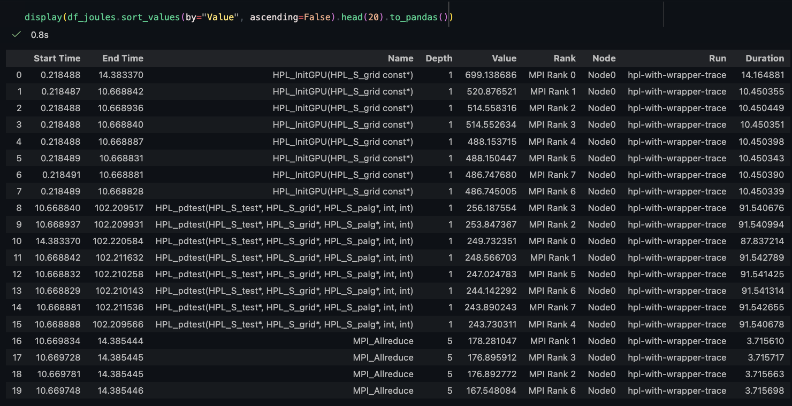
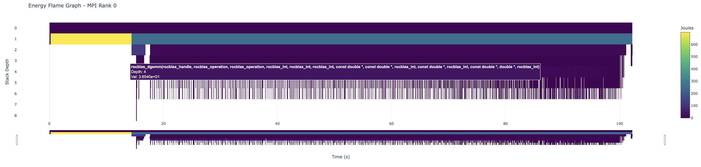
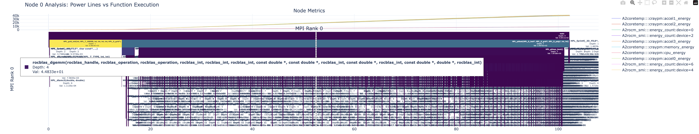
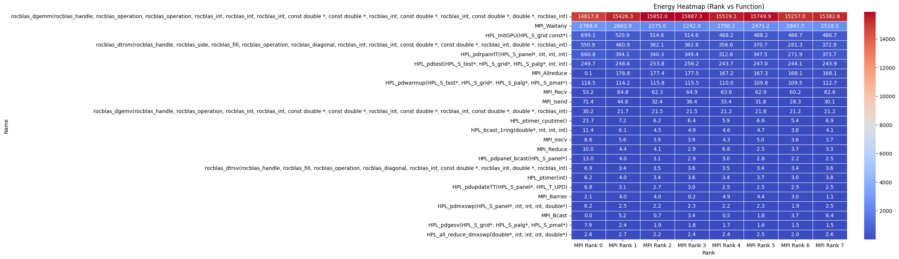
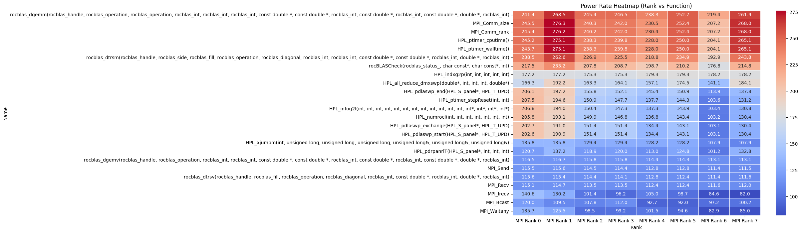

# ampere⚡

A tool for analyzing ensembles or individual runs of exascale OTF2 traces and attributing metrics (primarily energy and power) to functions and code regions. It provides visualizations such as heatmaps and flamegraphs to help identify energy hotspots in the code. It utilizes [Arkouda](https://github.com/Bears-R-Us/arkouda) to handle arbitrarily large traces that don't fit in a single node's memory, and is designed to be extensible to support new metrics and visualizations.

## Installation

Ampere uses python and can be installed via pip. It's recommended to use `conda` to manage your dependencies since the required Pandas and Numpy versions may conflict with your other packages.

```bash
git clone https://github.com/adam-mcdaniel/ampere
# The use of `conda` is recommended to manage dependencies:
# you might want to create a new environment for ampere.
cd ampere && pip install .
```

## Usage

### Setting Up Metric Configurations and Topology

The snippet below does the following:
1. Connects to the Arkouda server to enable distributed data processing for large traces.
2. Defines metric configurations using regular expressions to match metric names, specifying whether they are cumulative or instantaneous and applying a scale factor to convert raw values to more interpretable units (e.g., from microjoules to joules). This will allow Ampere to automatically apply the correct processing logic to each metric based on its name.
3. Defines a custom topology resolver function that maps metric names to the corresponding MPI ranks based on the device they are associated with. This is necessary because in this example, each GPU device is shared by 2 MPI ranks, so we need to ensure that the metrics are correctly attributed to the ranks that are using the corresponding GPU devices. For example, GPU energy usage must be shared between the ranks that are using that GPU, rather than being attributed to all ranks or just one rank.
4. Loads the OTF2 trace from the specified path into an `Ensemble` object, using the defined topology and metric configurations to correctly attribute metrics to ranks and functions. Ensembles may contain multiple runs (e.g., from multiple trials of an application), but in this case we are loading a single run from the specified trace path.

```python
import re
from ampere import Ensemble, MetricConfig, MetricType, AmpereSession, Visualizer, connect

connect(server="localhost", port=5555)

# Define Metric Configs
configs = {
    re.compile(r".*rocm.*energy.*"): MetricConfig(MetricType.CUMULATIVE, scale_factor=1e-6),
    re.compile(r".*rocm.*power.*"): MetricConfig(MetricType.INSTANTANEOUS, scale_factor=1e-6),
}

# Define Topology Resolver
def my_hpc_topology(metric_name, ranks):
    # Each of our GPU devices is shared by 2 MPI ranks, so we map metric names to the corresponding ranks
    if 'device=4' in metric_name: return [r for r in ranks if r.name in ['MPI Rank 0', 'MPI Rank 1']]
    if 'device=2' in metric_name: return [r for r in ranks if r.name in ['MPI Rank 2', 'MPI Rank 3']]
    if 'device=6' in metric_name: return [r for r in ranks if r.name in ['MPI Rank 4', 'MPI Rank 5']]
    if 'device=0' in metric_name: return [r for r in ranks if r.name in ['MPI Rank 6', 'MPI Rank 7']]
    return ranks

# Load Traces
ranks = [f"MPI Rank {i}" for i in range(8)]
topo = {"Node0": ranks}
ensemble = Ensemble.from_trace_paths(["./hpl-with-wrapper-trace"], topo, configs)
```

### Analyzing and Visualizing Node Metrics

Now that we have loaded the trace data into an `Ensemble`, we can analyze the metrics for a specific node and visualize them.

```python
df_joules = ak.DataFrame.concat([
    ensemble.attribute(
        metric,
        topology_resolver=my_hpc_topology,
        strategy='exclusive'
    ) for metric in [
        "A2rocm_smi:::energy_count:device=0",
        "A2rocm_smi:::energy_count:device=2",
        "A2rocm_smi:::energy_count:device=4",
        "A2rocm_smi:::energy_count:device=6"]
])
print("Attribution complete.")
```

This generates an Arkouda DataFrame containing the callgraph for the trace, annotated with the exclusive GPU energy usage attributed to each individual function call for each rank. The `topology_resolver` ensures that the energy metrics are correctly attributed to the ranks that are using the corresponding GPU devices, rather than being attributed to all ranks or just one rank.



Next, we can visualize this data as a Flamegraph to show where the GPu energy usage is spent in the application.

```python
# Visualize Flamegraph for Rank 0
print("Generating Flamegraph...")
Visualizer.plot_flamegraph(
    df_joules, 
    rank_filter="MPI Rank 0", 
    metric_name="Joules"
)
```



To also include a separate line graph with the metrics, and multiple ranks on the same plot, we can use the `plot_node_view` function:

```python
node_metrics = ensemble.runs[0].nodes[0].metrics # Get all the metrics from node 0 on the first run of the ensemble
metrics_to_plot = [m for name, m in node_metrics.items() if "energy_count" in name]

Visualizer.plot_node_view(
    attributed_df=df_joules,
    ranks=["MPI Rank 0", "MPI Rank 1"],
    metrics_data=metrics_to_plot,
    title = "Power Lines vs Callgraph for Node 0 (Exclusive Attribution)
)
```




### Visualizing Heatmaps of Energy and Power

To visualize a heatmap of energy usage by rank and function, we can use the `plot_heatmap` function. This will show us which ranks and functions are consuming the most energy, allowing us to identify hotspots in the code.

```python
# Sum the energy consumed by every call to each function for each rank, and plot a heatmap of the results
Visualizer.plot_heatmap(df_joules, "Energy Heatmap (Rank vs Function)", cmap='coolwarm', top_n=24, aggregation_func='sum')
```



Interesting! Here we see that `rocblas_dgemm` uses almost all the GPU energy, followed by `MPI_Waitany`. This is expected since `rocblas_dgemm` is the main driver of the computation in HPL, and `MPI_Waitany` is likely stalling on communication while waiting for messages to arrive from other ranks. We can also visualize the power usage in a similar way, by taking the derivative of the cumulative energy to get the instantaneous power, and plotting a heatmap of that:


```python
# Get the power by taking the derivative of the energy metric, and plot a heatmap of the results
df_energy_rate = ak.DataFrame.concat([
    ensemble.attribute(
        metric,
        topology_resolver=my_hpc_topology,
        output_mode='rate',
        strategy='exclusive'
    ) for metric in ["A2rocm_smi:::energy_count:device=0", "A2rocm_smi:::energy_count:device=2", "A2rocm_smi:::energy_count:device=4", "A2rocm_smi:::energy_count:device=6"]
])

# Visualize Heatmap of Rates
# We use the mean power for each call instead of summing the wattages
Visualizer.plot_heatmap(df_energy_rate, "Power Rate Heatmap (Rank vs Function)", cmap='coolwarm', top_n=24, aggregation_func='mean')
```


